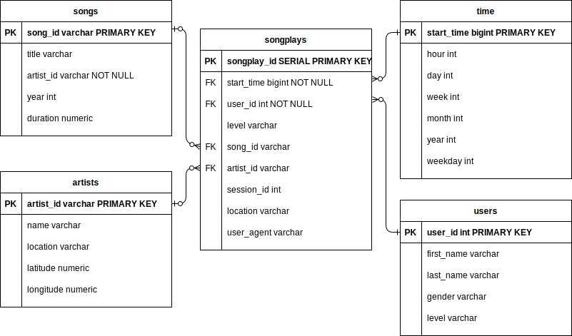

# PROJECT 1: Data Modeling with Postgres

## About The Project

- Author: Seyoung Nam
- E-mail: seyoung.nam@gmail.com
- Date: 2021-08-10
- Purpose: Define fact and dimension tables for a star schema for a particular analytic focus, and write an ETL pipeline that transfers data from files in two local directories into these tables in Postgres using Python and SQL
- Technologies: Python, PostgreSQL
- This project is a part of <a href="https://www.udacity.com/course/data-engineer-nanodegree--nd027" target="_blank">Udacity's Data Engineering Nanodegree Program</a>.

 

### 1. How to run the Python scripts

Open the `test.ipynb` file and execute `%run etl.py` command. Run the rest of commnads to check if the data is properly loaded in each table.

 

### 2. Files in the repository

1. `data` directory contains raw files to create tables.
2. `create_tables.py` drops and creates your tables. You run this file to reset your tables before each time you run your ETL scripts.
3. `etl.ipynb` reads and processes a single file from song_data and log_data and loads the data into your tables. This notebook contains detailed instructions on the ETL process for each of the tables.
4. `etl.py` reads and processes files from song_data and log_data and loads them into your tables. You can fill this out based on your work in the ETL notebook.
5. `README.md` contains basic information about the project.
6. `schema.svg` contains an Entity Relationship Diagram of the database.
7. `sql_queries.py`contains all your sql queries, and is imported into the last three files above.
8. `test.ipynb` displays the first few rows of each table to let you check your database.

 

### 3. The purpose of this database

The database reorganizes contents in the log files into several relevant categories so that the company could easily identify useful data, retrieve the necessary one, and even extract insights about users' activity in the app. In the end, the database helps the company create a business strategy for future growth.

 

### 4. Database schema design

The current database applies the star schema where a fact table("songplays") captures users' activity in the music app by accumulating information from four dimension tables - "users", "songs", "artists", and "time".

 

### 5. ETL pipeline

| Extract             | Transform   | Load             |  
| ------------------- | ----------- | ---------------- |
| "song_data" dataset | N/A         | "songs" table    |
| "song_data" dataset | N/A         | "artists" table  |
| "log_data" dataset  | Extract the hour, day, week, month, year, and weekday from the timestamp | "time" table     |
| "log_data" dataset  | N/A         | "users" table     |
| Four tables (songs, artists, time, users)  | N/A         | "songplays" table     |

 

### 6. [Optional] Provide example queries and results for song play analysis.

If you want to look up the activity percentage of "paid" app users, you can get the result by the following queries.

        SELECT ROUND(
          100.0 * (
              SUM(CASE WHEN level = 'paid' THEN 1 ELSE 0 END)::numeric / COUNT(level)
          ), 1) AS percent_total 
        FROM songplays;
        
The calculated result is 82.0%.
(reference: https://stackoverflow.com/questions/1183929/how-to-do-percent-total-in-sql/1183950)